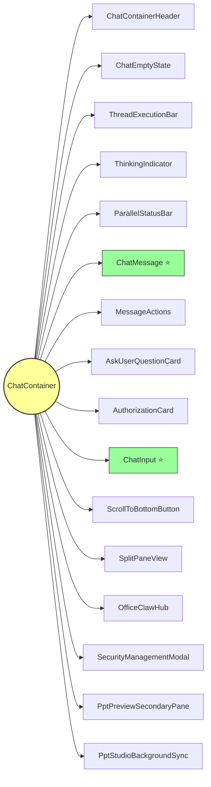
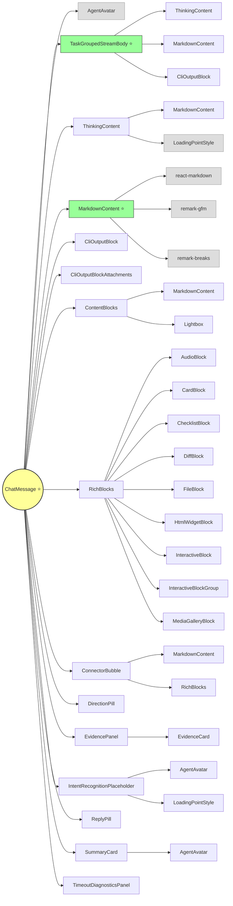
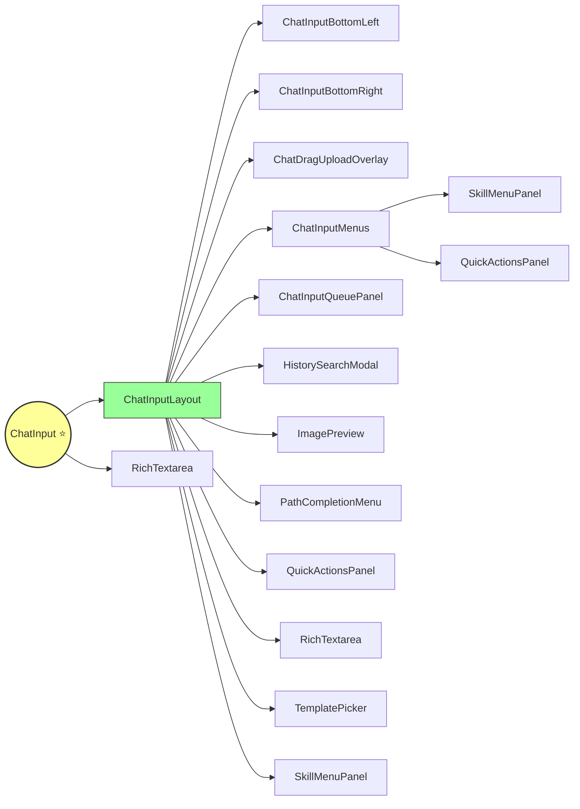
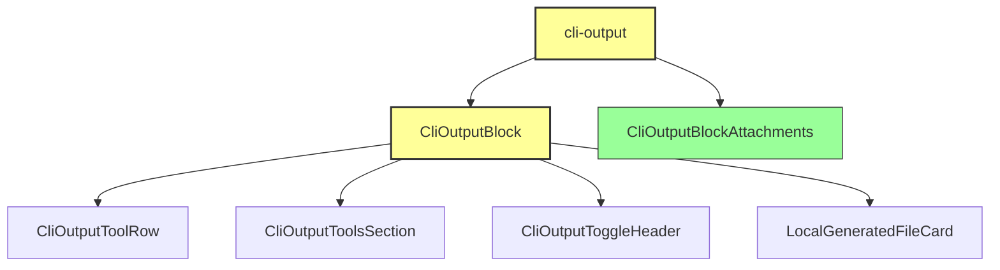

# 对话组件树

核心组件：

- ChatContainer.tsx -- 使用 ChatInput，在已有对话里继续对话时走这里的逻辑
- HomePage.tsx -- 使用 ChatInput，新对话时走这里的逻辑
- ChatMessage -- 单条消息气泡
- ChatInput -- 聊天输入框
- CliOutput -- 工具调用
- MarkdownContent -- 回答正文
- TaskGroupedStreamBody -- 任务列表

## ChatContainer 组件依赖树（核心视图）

```
ChatContainer
├── ChatContainerHeader ─── HubButton
├── ChatEmptyState
├── ThreadExecutionBar ─── AgentStreamStatusChip
├── ThinkingIndicator
├── ParallelStatusBar
│
├── ChatMessage ⭐ (消息气泡 - 核心)
│   ├── AgentAvatar
│   ├── TaskGroupedStreamBody ⭐ (任务分组流式渲染)
│   │   ├── ThinkingContent ─── MarkdownContent
│   │   ├── MarkdownContent (任务内流式正文)
│   │   └── CliOutputBlock (任务内工具调用)
│   ├── ThinkingContent (思考过程)
│   ├── MarkdownContent ⭐ (AI 正文)
│   ├── CliOutputBlock (工具调用)
│   │   ├── CliOutputToolRow
│   │   ├── CliOutputToolsSection
│   │   └── LocalGeneratedFileCard
│   ├── CliOutputBlockAttachments
│   ├── ContentBlocks ─── MarkdownContent + Lightbox
│   ├── RichBlocks (富内容)
│   │   ├── CardBlock / DiffBlock / ChecklistBlock
│   │   ├── AudioBlock / FileBlock / MediaGalleryBlock
│   │   └── InteractiveBlock / HtmlWidgetBlock
│   ├── ConnectorBubble ─── MarkdownContent + RichBlocks
│   ├── DirectionPill / ReplyPill
│   ├── EvidencePanel ─── EvidenceCard
│   ├── IntentRecognitionPlaceholder
│   ├── SummaryCard
│   └── TimeoutDiagnosticsPanel
│
├── MessageActions ─── ConfirmDialog + MessageFeedbackActions + MessageCopyButton
├── AskUserQuestionCard ─── Button
├── AuthorizationCard ─── Button
│
├── ChatInput ⭐ (输入框 - 核心)
│   └── ChatInputLayout
│       ├── RichTextarea (富文本编辑区)
│       ├── ChatInputBottomLeft (附件/语音/工作区)
│       ├── ChatInputBottomRight (发送/停止)
│       ├── ChatDragUploadOverlay
│       ├── ChatInputMenus ─── SkillMenuPanel + QuickActionsPanel
│       ├── ChatInputQueuePanel
│       ├── HistorySearchModal
│       ├── ImagePreview
│       ├── PathCompletionMenu
│       ├── QuickActionsPanel
│       ├── TemplatePicker
│       └── SkillMenuPanel
│
├── ScrollToBottomButton
├── SplitPaneView ─── ChatInput + MiniThreadSidebar + SplitPaneCell
├── OfficeClawHub
├── SecurityManagementModal ─── AppModal + SearchInput + ToggleSwitch
├── PptPreviewSecondaryPane
└── PptStudioBackgroundSync
```

## ChatContainer 组件树（第一层）



## ChatMessage 组件树（chat-message）



## ChatInput 组件树（chat-input）



## CliOutput 组件树（cli-output）



## 分层说明

### 第 1 层：ChatContainer 直接子组件

| 组件 | 职责 |
|---|---|
| **ChatContainerHeader** | 顶部栏：主题切换、智能体状态指示、Hub 入口 |
| **ChatEmptyState** | 空对话状态：智能体配置/渠道入口卡片 |
| **ThreadExecutionBar** | 执行状态条：显示正在运行的智能体 + 停止按钮 |
| **ThinkingIndicator** | 思考指示器：智能体正在思考的动画提示 |
| **ParallelStatusBar** | 并行状态栏：多智能体并行执行状态 + token/耗时 |
| **ChatMessage** ⭐ | 消息气泡：用户消息 + AI 回复的核心渲染 |
| **MessageActions** | 消息操作：复制、反馈、删除、编辑、分支 |
| **AskUserQuestionCard** | 用户选择卡片：AI 询问用户时的选项 UI |
| **AuthorizationCard** | 授权卡片：工具调用需要用户审批时的 UI |
| **ChatInput** ⭐ | 输入框：文本输入 + @mention + 技能 + 附件 + 队列 |
| **ScrollToBottomButton** | 滚动到底部按钮 |
| **SplitPaneView** | 分屏视图：双线程并排展示 |
| **OfficeClawHub** | Hub 面板：智能体/模型/技能配置管理 |
| **SecurityManagementModal** | 安全管理弹窗：工具权限管理 |
| **PptPreviewSecondaryPane** | PPT 预览副面板 |
| **PptStudioBackgroundSync** | PPT 工作室后台同步 |

### 第 2 层：ChatMessage 子组件（消息气泡内部）

| 组件 | 职责 |
|---|---|
| **AgentAvatar** | 智能体头像 |
| **TaskGroupedStreamBody** ⭐ | 任务分组流式渲染：按 task 分段展示思考+工具+正文 |
| **ThinkingContent** | 思考过程展示（可折叠） |
| **MarkdownContent** ⭐ | Markdown 正文渲染（react-markdown + remark-gfm） |
| **CliOutputBlock** | CLI 工具调用展示：tool_use + tool_result |
| **CliOutputBlockAttachments** | 工具产出附件展示 |
| **ContentBlocks** | 内容块：图片/文件预览 + Lightbox |
| **RichBlocks** | 富内容块：card/diff/checklist/audio/file 等 |
| **ConnectorBubble** | 连接器消息气泡（微信/飞书等渠道消息） |
| **DirectionPill** | 方向标签（@mention 指向） |
| **EvidencePanel** | 证据面板 |
| **IntentRecognitionPlaceholder** | 意图识别占位符（等待分配智能体） |
| **ReplyPill** | 回复标签 |
| **SummaryCard** | 对话摘要卡片 |
| **TimeoutDiagnosticsPanel** | 超时诊断面板 |

### 第 3 层：TaskGroupedStreamBody 子组件（任务列表渲染）

| 组件 | 职责 |
|---|---|
| **ThinkingContent** | 每个任务段的思考过程 |
| **MarkdownContent** | 每个任务段的流式正文 |
| **CliOutputBlock** | 每个任务段的工具调用 |
| **LoadingPointStyle** | 流式加载动画点 |
| **CliOutputBasicIcons** | CLI 基础图标（✓/✗/停止） |

### 第 2 层：ChatInput 子组件（输入框内部）

| 组件 | 职责 |
|---|---|
| **ChatInputLayout** | 输入框布局容器 |
| **RichTextarea** | 富文本编辑区（支持 @mention/技能token 高亮） |
| **ChatInputBottomLeft** | 底部左侧控件（附件/语音/工作区） |
| **ChatInputBottomRight** | 底部右侧控件（发送/队列发送/停止） |
| **ChatDragUploadOverlay** | 拖拽上传遮罩 |
| **ChatInputMenus** | 弹出菜单容器（mention/技能/工作区菜单） |
| **ChatInputQueuePanel** | 队列面板 |
| **HistorySearchModal** | 历史搜索弹窗 |
| **ImagePreview** | 图片预览 |
| **PathCompletionMenu** | 路径补全菜单 |
| **QuickActionsPanel** | 快捷操作面板 |
| **TemplatePicker** | 模板选择器（PPT 模板） |
| **SkillMenuPanel** | 技能菜单面板 |

### 第 3 层：RichBlocks 子组件（富内容渲染）

| 组件 | 职责 |
|---|---|
| **CardBlock** | 卡片块 |
| **DiffBlock** | 代码差异块 |
| **ChecklistBlock** | 清单块 |
| **AudioBlock** | 音频块 |
| **FileBlock** | 文件块 |
| **HtmlWidgetBlock** | HTML 小部件块 |
| **InteractiveBlock** | 交互块（按钮/表单） |
| **InteractiveBlockGroup** | 交互块组 |
| **MediaGalleryBlock** | 媒体画廊块 |

### 第 3 层：CliOutputBlock 子组件（工具调用渲染）

| 组件 | 职责 |
|---|---|
| **CliOutputToolRow** | 单个工具调用行 |
| **CliOutputToolsSection** | 工具调用区域 |
| **CliOutputToggleHeader** | 折叠切换头 |
| **LocalGeneratedFileCard** | 本地生成文件卡片 |
| **CliOutputToolRowLabel** | 工具行标签 |
| **CliOutputFileCardActionsMenu** | 文件卡片操作菜单 |

## Hooks 依赖（ChatContainer 使用的核心 Hooks）

| Hook | 职责 |
|---|---|
| **useSocket** | Socket.IO 连接管理 + 事件监听 |
| **useChatSocketCallbacks** | Socket 事件回调（onMessage/onTaskCreated 等） |
| **useAgentMessages** | 流式消息处理（handleAgentMessage/handleStop） |
| **useSendMessage** | 消息发送（HTTP POST + 乐观更新） |
| **useChatHistory** | 聊天历史加载 |
| **useAuthorization** | 工具授权管理 |
| **useAskUserQuestion** | 用户询问管理 |
| **useAgentData** | 智能体数据缓存 |
| **useSplitPaneKeys** | 分屏键管理 |
| **useVadInterrupt** | VAD 中断 |
| **useVoiceAutoPlay** | 语音自动播放 |
| **useVoiceStream** | 语音流 |

## Stores 依赖

| Store | 职责 |
|---|---|
| **chatStore** (Zustand) | 核心状态：messages、isLoading、hasActiveInvocation、activeInvocations、threads |
| **taskStore** (Zustand) | 任务列表：tasks (addTask/updateTask) |
| **inputHistoryStore** | 输入历史 |
| **toastStore** | Toast 通知 |
| **authorizationPendingStore** | 待审批授权 |

本文写于：2026年5月21日
