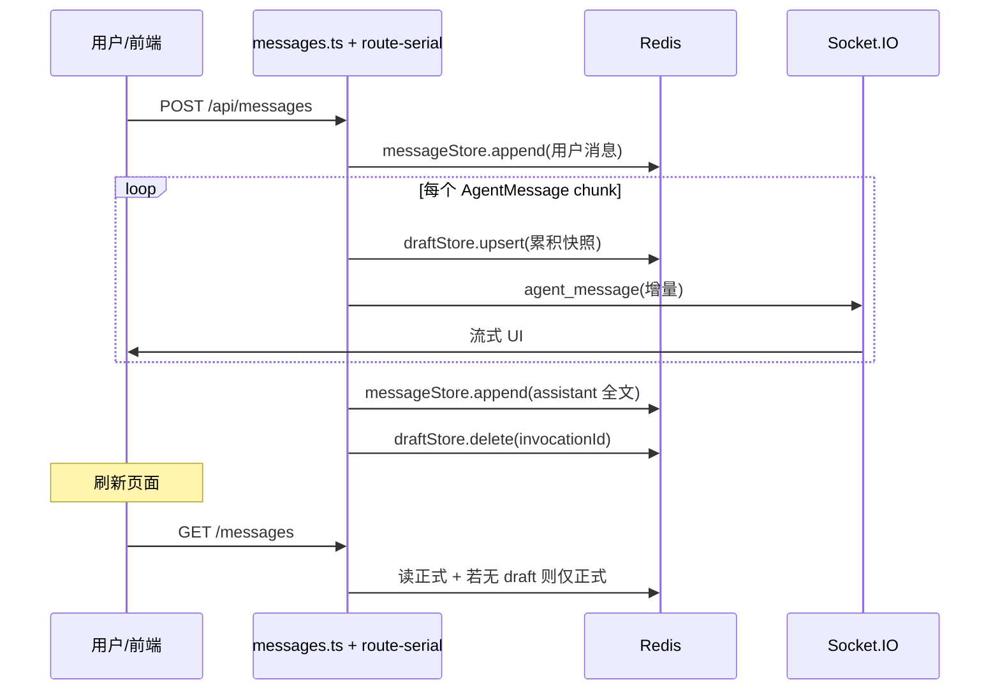

# Redis 持久化数据

内存中的数据会随着页面刷新和关闭丢失，因此必须存一份持久化数据，流式数据才能接上和恢复。

> Redis 数据可以通过 [AnotherRedisDesktopManager](https://github.com/qishibo/AnotherRedisDesktopManager) 工具进行查看。

## 对话数据持久化到 Redis 数据库

三条并行通路

```
[智能体 Provider / 九问 WS]  chat.delta / tool / done ...
        ↓ relayclaw-event-transform
[AgentMessage 流]  route-serial / route-parallel
        ├─① draftStore.upsert（流式过程中，节流）
        ├─② yield → messages.ts → broadcastAgentMessage → 前端 WS agent_message
        └─③ messageStore.append（本轮结束，一次性）
```

|数据类型	|谁触发写入	|与 WS 的关系|
|--|--|--|
| 用户消息（浏览器 POST、微信/飞书 connector）| 收到请求后立刻 messageStore.append| 用户消息常靠 HTTP 响应或 connector_message WS；不进 draft| 
| 草稿 draft| route-* 在流式循环里 draftStore.upsert| 与 WS 并行；先于或接近 yield，不依赖前端是否在线| 
| 正式 assistant 消息| 单轮流结束（done 后）messageStore.append 一条| WS 已推完增量；落库后 delete draft| 

## 草稿（Draft）什么时候写？

写在 route-serial.ts / route-parallel.ts 的 #80 Draft flush：

- 触发条件（累积后）：text 增量、thinking、tool_use/tool_result、task 边界、taskProgress/taskRuns 变化等。
- 节流：
  - 串行 route-serial：约 200ms 间隔，或单次字符增量 ≥ 2000。
  - 并行 route-parallel：约 2s 间隔（多 agent 同时跑）。
- 长工具静默期：60s touch keepalive，避免只有 tool、无 text 时草稿“失联”。
- 串行模式 Scheme A：注释写明在 yield 给前端之前先 await draftStore.upsert，缩小「前端已看到、Redis 还没有」的窗口。
- 并行模式：upsert 多为 fire-and-forget（.catch(noop)）。

删除草稿：messageStore.append 成功之后才 draftStore.delete；若正式落库失败，保留 draft，便于 F5/刷新恢复。

用户停止：POST /api/threads/:threadId/stream-stopped 给 draft 打 userStopped: true，并对已落库的 origin: 'stream' 消息更新 extra.stream.userStopped。

## 正式消息什么时候写？

### 用户侧（不进 draft）

- 浏览器 POST /api/messages：先 messageStore.append（agentId: null），再后台 routeExecution。
- 微信/飞书等：ConnectorRouter 里 messageStore.append（带 source: ConnectorSource），再 connector_message WS + 触发 agent。

### 智能体回复（一轮结束写一条）

在 route-serial 流式循环结束后（已拼好全文、tools、thinking、rich、taskRuns 等），一次 messageStore.append：

route-serial.ts Lines 947-968
```typescript
          const storedMsg = await deps.messageStore.append({
            userId,
            agentId,
            content: storedContent,
            mentions: a2aMentions,
            origin: 'stream',
            timestamp: storedTimestamp,
            threadId,
            ...(thinkingContent ? { thinking: thinkingContent } : {}),
            ...(firstMetadata ? { metadata: firstMetadata } : {}),
            ...(collectedToolEvents.length > 0 ? { toolEvents: collectedToolEvents } : {}),
            extra: {
              ...(allRichBlocks.length > 0 ? { rich: { v: 1 as const, blocks: allRichBlocks } } : {}),
              ...(streamPersist ? { stream: streamPersist } : {}),
              ...(persistedTaskRuns ? { taskRuns: persistedTaskRuns } : {}),
              ...
            },
          });
```

WS 广播时机：messages.ts 对 routeExecution 的每个 yield 调用 broadcastAgentMessage——早于正式 append，且 每个 delta 一条 WS，不是等 Redis 写完再推。


messages.ts Lines 952-955
```typescript
            opts.socketManager.broadcastAgentMessage(
              { ...msg, invocationId: createResult.invocationId },
              resolvedThreadId,
            );
```

## Redis 里长什么样？

### 草稿 DraftRecord → Hash + Set 索引

键（带 office-claw: 前缀）：

- draft:{userId}:{threadId}:{invocationId} → Hash
- drafts:idx:{userId}:{threadId} → Set（成员为 invocationId）

逻辑结构（draft-types.ts）：

```
{
  userId, threadId, invocationId, agentId,
  content: string,              // 当前已累积正文
  toolEvents?: unknown[],
  thinking?: string,
  taskRuns?: TaskRunPersistExtra,
  taskProgress?: { v: 1; tasks: [...]; snapshotStatus?: ... },
  userStopped?: boolean,
  updatedAt: number
}
```

Redis Hash 字段（RedisDraftStore.upsert）：标量字符串 + toolEvents/taskRuns/taskProgress 为 JSON 字符串；userStopped 为 '1'。

### 正式 StoredMessage → Hash + 多个 ZSET

键：

- msg:{id} → Hash
- msg:timeline、msg:user:{userId}、msg:thread:{threadId}、msg:mentions:{agentId} → ZSET（score = timestamp）

逻辑结构（message-types.ts，节选）：
```
{
  id, threadId, userId,
  agentId: AgentId | null,       // 用户消息为 null
  content: string,
  contentBlocks?, toolEvents?, thinking?, metadata?,
  mentions, timestamp,
  origin?: 'stream' | 'callback',
  source?: ConnectorSource,      // 渠道用户消息
  extra?: {
    stream?: { invocationId, durationMs?, userStopped? },
    rich?, taskRuns?, taskProgress?, artifactGenerated?, ...
  },
  deliveryStatus?, replyTo?, visibility?, ...
}
```
流式 assistant 消息通过 extra.stream.invocationId 与本轮 invocationId 关联，用于去重、停止态、草稿合并。

## 使用场景对比

| 维度	| 草稿 Draft	| 正式 Message| 
|--|--|--|
| 生命周期| 本轮执行中；成功 append 后删除| 默认 TTL ~90 天，长期历史| 
| 粒度| 同一 invocationId 反复 覆盖 upsert| 一轮回复通常 一条 assistant 记录| 
| 主要读者| GET .../messages 首页无 before 时 merge draft；F5/断线重连| 分页历史、搜索、@提及索引、渠道回传、审计| 
| 前端实时| 不直接推 draft；靠 WS agent_message 增量| 落库后刷新/翻页可见；与 WS 内容应对齐| 
| 用户/渠道消息| 不用| 立即 append| 
| 停止| userStopped 在 draft + 可能 patch 已落库 stream| extra.stream.userStopped| 

GET 合并草稿（仅第一页、无 before）：

messages.ts Lines 1436-1456
```typescript
        for (const d of activeDrafts) {
          chatItems.push({
            id: `draft-${d.invocationId}`,
            type: 'assistant',
            content: d.content,
            isDraft: true,
            origin: 'stream',
            extra: { stream: { invocationId: d.invocationId, ... } },
            ...(d.toolEvents ? { toolEvents: d.toolEvents } : {}),
            ...(d.thinking ? { thinking: d.thinking } : {}),
          });
        }
```
若同一 invocationId 已有正式 extra.stream.invocationId，则 不再合并 该 draft（防双气泡）。

## 时间线（一轮浏览器对话）



微信/飞书：用户话在 步骤 0 就由 ConnectorRouter 写入正式消息；智能体阶段与上图 loop 相同；用户气泡不走 draft。

## 注意点

1. WS 不写 Redis——写 Redis 的是 route-* + messageStore/draftStore；WS 只是 yield 之后的广播。
2. 草稿 = 流式过程中的可恢复快照（节流 upsert）；正式 = 一轮结束的单条归档（append 后删 draft）。
3. 在线看流：主要靠 WS；刷新/断线/关页再开：靠 draft merge + 正式历史。
4. 用户与渠道 inbound：只进正式库，没有 draft 阶段。

## Redis 里 draft 草稿 vs 正式 message 的数据格式


### Draft（流式草稿）

Redis key 设计

- draft:{userId}:{threadId}:{invocationId} -> Hash（草稿详情）
- drafts:idx:{userId}:{threadId} -> Set（invocationId 索引）

逻辑结构（DraftRecord）

```
{
  userId: string,
  threadId: string,
  invocationId: string,
  agentId: AgentId,
  content: string,
  toolEvents?: unknown[],
  thinking?: string,
  taskRuns?: TaskRunPersistExtra,
  taskProgress?: { v:1, tasks:[...], snapshotStatus?: ... },
  userStopped?: boolean,
  updatedAt: number
}
```

Hash 常见字段：userId/threadId/invocationId/agentId/content/updatedAt/userStopped/toolEvents/thinking/taskRuns/taskProgress

### 正式 Message（持久消息）

Redis key 设计

- msg:{id} -> Hash（消息详情）
- msg:timeline -> ZSET（全局时间线）
- msg:user:{userId} -> ZSET
- msg:thread:{threadId} -> ZSET
- msg:mentions:{agentId} -> ZSET

逻辑结构（StoredMessage）
```
{
  id: string,
  threadId: string,
  userId: string,
  agentId: AgentId | null,
  content: string,
  contentBlocks?: [...],
  toolEvents?: [...],
  metadata?: { provider, model, sessionId?, usage? ... },
  extra?: {
    rich?,
    stream?: { invocationId, durationMs?, userStopped? },
    crossPost?, targetAgents?, errorFallback?,
    taskRuns?, taskProgress?, artifactGenerated?
  },
  mentions: AgentId[],
  mentionsUser?: boolean,
  timestamp: number,
  thinking?: string,
  origin?: "stream"|"callback",
  visibility?: "public"|"whisper",
  whisperTo?: AgentId[],
  deliveredAt?: number,
  deliveryStatus?: "queued"|"delivered"|"canceled",
  replyTo?: string,
  deletedAt?: number,
  deletedBy?: string,
  _tombstone?: true
}
```

一句话区分：

- draft：流式中的“临时未定稿”快照（按 invocationId 维度，供 F5 恢复）
- message：最终正式消息（按 message id 维度，长期查询/分页/软删/提及索引）

本文写于：2026年6月2日
