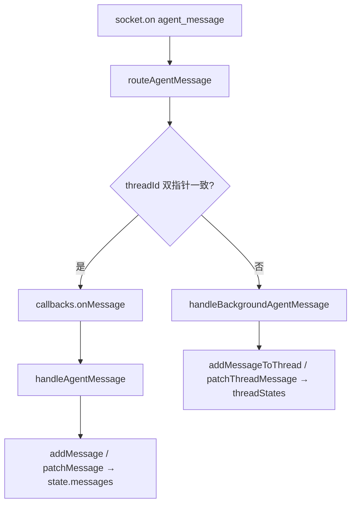

# Zustand 全局内存数据

Zustand 是 React 全局数据，存在内存中，是真正用来渲染 UI 的数据。

> Zustand 数据可以通过 Redux DevTools 插件进行查看。

## WebSocket 消息如何写进全局 Store

useChatStore 里是 双轨结构：

|存储位置|	含义	|谁在读|
|--|--|--|
| messages（扁平字段）| 当前正在看的那个 currentThreadId 的消息列表| ChatContainer 列表、useAgentMessages 的 addMessage / patchMessage| 
| `threadStates[threadId].messages`| 其它会话的快照（后台流式、未读等）| 切走后的后台 WS、addMessageToThread / patchThreadMessage|

切换会话时，setCurrentThread 会把当前扁平状态快照进 `threadStates[旧 id]`，再把目标会话展平到 `messages`：

chatStore.ts Lines 1611-1644
```typescript
  /**
   * Switch active thread.
   * Saves current flat state into threadStates map, then restores the target thread's state.
   */
  setCurrentThread: (threadId) =>
    set((state) => {
      // ...
      const saved = snapshotActive(state);
      const loaded = state.threadStates[threadId] ?? { ...DEFAULT_THREAD_STATE };
      return {
        currentThreadId: threadId,
        threadStates: {
          ...state.threadStates,
          [state.currentThreadId]: saved,
        },
        ...flattenThread(loaded),
      };
    }, 'setCurrentThread'),
```

界面上看到的「全局 messages」其实是「当前会话的 messages」；其它 thread 在 threadStates 里各有一份。


一条 WebSocket → 写入 store 的完整链路：



### 入口：useSocket（单连接、多 room）

- 全页通常只有 一个 io(API_URL)（ChatContainer 或 HomePage mount 时创建）。
- 已 join_room 的多个 thread:* 都会收到服务端广播；靠 msg.threadId 分流，不是靠多条 WS。

### 路由：routeAgentMessage（防串台的第一道门）

useSocket.ts Lines 489-571
```typescript
    const routeAgentMessage = (routedMsg, originalMsg, ...) => {
      const routeThread = threadIdRef.current;           // useSocket 入参：当前页会话
      const storeThread = useChatStore.getState().currentThreadId;
      const isActiveThreadMessage = Boolean(
        routedMsg.threadId &&
          routeThread &&
          storeThread &&
          routedMsg.threadId === routeThread &&
          routedMsg.threadId === storeThread,
      );
      if (!routedMsg.threadId) { /* 缓冲或丢弃，避免写错 thread */ }
      if (isActiveThreadMessage) {
        callbacksRef.current.onMessage(routedMsg);  // → handleAgentMessage
        return;
      }
      handleBackgroundAgentMessage(routedMsg, { store, bgStreamRefs, ... });
    };
```

要点：

- 必须同时满足：WS 路由的 threadId == useSocket 的 threadId == store 的 currentThreadId。
- 避免「路由已是 B，store 还是 A」的切换窗口里误写扁平 messages。
- 无 threadId 的包 不写活跃会话，先缓冲或触发 requestThreadLiveRefresh 从 HTTP 拉齐。

### 当前会话：handleAgentMessage → 扁平 messages

ChatContainer 把 handleAgentMessage 接到 onMessage：

useChatSocketCallbacks.ts Lines 52-54
```typescript
      onMessage: (msg) => {
        handleAgentMessage(msg);
        return true;
      },
```

流式逻辑在 useAgentMessages 里（activeRefs 记「哪个 agent 正在往哪个 bubble id 写」）：

- text / thinking → patchMessage 追加内容、setStreaming
- 新气泡 → addMessage
- 全部落在 state.messages（仅当前 thread）

第二道保险：

useAgentMessages.ts Lines 767-778
```typescript
      if (msg.threadId && currentThreadId && msg.threadId !== currentThreadId) {
        // ignored_cross_thread
        return;
      }
```

### 后台会话：useSocket-background → threadStates

切走后，同一 WS 仍可能收到旧 thread 的流式包 → 走 handleBackgroundAgentMessage：

- addMessageToThread(threadId, msg) / patchThreadMessage(threadId, ...)
- setThreadMessageStreaming 等 只改 threadStates[threadId]
- 用 bgStreamRefs（key=threadId::agentId）跟踪后台 bubble，避免重复建气泡

## 切换会话时怎么不乱？

切换由 ChatContainer 的 threadId（路由）驱动，顺序大致是：

ChatContainer.tsx Lines 327-340
```typescript
  useEffect(() => {
    if (prevThreadRef.current !== threadId) {
      setCurrentThread(threadId);      // 快照旧 thread → 恢复新 thread 的 messages
      resetRefsForThreadSwitch(threadId); // 清 activeRefs，从 messages 里恢复流式 bubble
    }
    setCurrentThread(threadId);
  }, [threadId, ...]);
  useEffect(() => {
    if (!threadId || isLoadingHistory) return;
    rehydrateStreamingRefs(threadId);  // 历史加载完后再绑一次流式 ref
  }, [threadId, isLoadingHistory, ...]);
```

|机制	|作用|
|--|--|
| setCurrentThread| 旧会话整包进 threadStates；新会话从缓存或默认恢复进 messages| 
| 双指针路由| 切换瞬间 WS 仍可能打到旧 thread → 写进 threadStates[旧]，不污染新 messages| 
| resetRefsForThreadSwitch| 清空 activeRefs 等内存映射，避免 B 会话误用 A 的 bubble id| 
| rehydrateStreamingRefs| 从已恢复的 messages 里找 isStreaming 的 assistant，重新挂 ref（后台继续写对 bubble）| 
| useChatHistory bootstrap| 见下一节| 

useChatHistory(threadId) 在切换时还会：

- 有缓存且未在跑：直接用 threadStates 里已恢复的消息，可跳过拉历史；
- 有 hasActiveInvocation / 未读 / 气泡身份不稳：fetchHistory({ replace: true }) 用服务端权威数据覆盖；
- fetchHistory 带 expectedThreadId：replaceMessages / prependHistory 若 currentThreadId 已变则 丢弃陈旧 HTTP 响应。

chatStore.ts Lines 1204-1214
```typescript
  replaceMessages: (msgs, hasMore, expectedThreadId) =>
    set((state) => {
      if (expectedThreadId && state.currentThreadId !== expectedThreadId) {
        console.warn('[replaceMessages] stale response dropped', ...);
        return state;
      }
      return { messages: msgs, hasMore };
    }, 'replaceMessages'),
```

## 刷新页面（F5）时怎么不乱？

| 步骤	| 行为|
|--|--|
| 内存清空| threadStates、messages 全丢| 
| useChatHistory| fetchHistory 从 `GET /api/messages?threadId=` 拉权威历史（含服务端 Draft）| 
| useSocket 重连| connect 后从 sessionStorage 恢复 join_room 列表 + 当前 threadId| 
| rehydrateStreamingRefs| 历史到位后，把仍在 streaming 的气泡重新绑到 activeRefs| 
| 重连对账| reconcileInvocationStateOnReconnect、requestThreadLiveRefresh 补断线期间漏掉的块| 

刷新后不以内存为准，以 `HTTP 历史` + `后续 WS` 为准；WS 只是增量更新。

## 注意点

- 一个连接 ≠ 一份 messages。
- 连接是传输层；业务按 threadId 路由 到：
  - 当前屏 → messages
  - 其它已 join 的 thread → threadStates[id].messages
- 侧边栏多个会话能同时收推送，是因为启动时批量 join_room，不是多个 WS。

首页 HomePage 也有一条 WS（onMessage 空实现），主要为了 thread_created 和后台 thread 的 room；真正写流式 UI 的是进入 /thread/:id 后的 ChatContainer。

- 写哪里：当前会话写 messages；其它会话写 threadStates[threadId].messages。
- 怎么分流：useSocket 双指针 + handleAgentMessage 再校验 threadId。
- 怎么切/刷：切会话靠 setCurrentThread 快照/恢复 + ref 重置 + 有条件强制拉历史；刷新靠 HTTP 全量 + WS 增量 + 重连对账。

## 前端如何把 websocket 流式消息转换成 Zustand messages

核心是两层：

### useSocket：先按 thread 路由

- 收到 agent_message 后，先做 thread 归属判断（active thread / background thread）。
- active thread -> callbacks.onMessage -> useAgentMessages.handleAgentMessage
- background thread -> handleBackgroundAgentMessage，写 threadStates[threadId].messages

还会用 invocationId -> threadId 映射修复缺失 threadId 的包，避免串会话。

### useAgentMessages：按消息类型写入 store

对 active thread 的转换大致是：

- text：
找/建当前 assistant 气泡 -> appendToMessage 流式追加
- tool_use / tool_result：
appendToolEvent 并同步 taskRuns
- system_info：
先 parseSystemInfoContent，再分支处理
  - thinking -> 写到 message.thinking / taskRuns
  - invocation_created -> 建立 invocation 状态
  - task_progress -> 写 agentInvocations[agent].taskProgress
  - rich_block / send_file_ready / artifact_generated -> 写 message.extra
- done：
关闭 streaming、收尾状态、清理 invocation 槽
- error：
降级为系统提示 + 状态收尾

最终落入 Zustand 的 ChatMessage 结构（messages 或 threadStates[threadId].messages）。

本文写于：2026年6月2日
